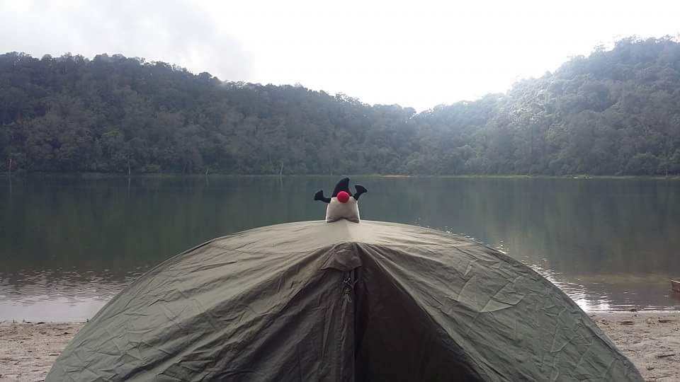

# Java Streams con Java 11

* Mario Batres
* CTO en Logistika 360
* @mariobatres7


---


## Introducción


* Una de las características importantes en Java 8 fue la introducción de Lambdas.
* El uso más importante fue el uso de Stream API.
* El Stream API permite manipular colecciones de manera funcional.
* Es un componente que es capaz de iterar de manera interna sus propios elementos.
* No han existido muchos cambios importantes desde Java 8  a Java 11.
---

## ¿Cómo es el procesamiento de un Stream? 


* Es posible agregar _listeners_ a un Stream.  Esto se llaman cuando el Stream recorre los elementos de manera interna.

* Los listeners forman una cadena de procesamiento, el primer listener procesa el elemento y este retorna un nuevo elemento o el mismo para que el siguiente listener en la cadena lo procese.

---


## Antes y Después de Java 8 (1)

Antes de Java 8:

```java 
Integer[] array = {1, 2, 3, 4, 5};

for (Integer element : array) {
    System.out.println(element);
}

```
---

## Antes y Después de Java 8 (2)


Desde Java 8:

```java 
Integer[] array = {1, 2, 3, 4, 5};
Stream.of(array).forEach(System.out::println);
```

---
## ¿Cómo usar Stream API?


* Desde Java 8 se agregó el método stream() a la interface _Collection_.
* Se puede utilizan en las clases que implementan la interfaces _List_ y _Set_.
  
```java
List<String> paisList = Arrays.asList("Guatemala",
                "El Salvador",
                "Honduras",
                "El Salvador",
                "Nicaragua",
                "Colombia",
                "Venezuela"),
                "Ecuador";

paisList.stream().forEach(pais -> System.out.println(pais));
        
```
---

## Operaciones Terminales 

* Empieza la interación de los elementos, llamando a todos los listeners y retorna un resultado.
* Retornan un valor simple.
* Dentro de las operaciones terminales están:
  * anyMatch
  * allMatch
  * noneMatch 
  * collect
  * count
  * findAny
  * ...
---


## Operaciones no Terminales 

* Agrega un listener a un stream sin hacer nada más.
* Es una operación que trasformar o filtra los elementos en el stream. 
* Cuando se agregar una operación no terminal, se obtiene como resultado un nuevo stream.
* Dentro de las operaciones no terminales están:
  * map 
  * filter 
  * flatMap
  * distinct
  * ...

---


## Operaciones con Stream API (1)

* forEach 
  * Este es el método más común del API.
  * Itera sobre los elementos del stream.
* map 
  * Produce un nuevo stream después de aplicar una función para cada elemento del stream original.
  * El nuevo stream puede ser **un nuevo tipo**.
* collect 
  * Devuelve una colección después de procesar un stream.
  * Una colección puede ser una _List_ o _Set_.
* filter 
  * Produce un nuevo stream luego de filtrarlo.
---


## Operaciones con Stream API (2)
* findFirst 
  * Retorna un tipo Optional para el primer elemento dentro del Stream.
* toArray
  * Transforma el resultado del stream en un array. 
* flatMap
  * Para uso de estructuras complejas, por ejmplo, un List<T> como attributo.
* peek
  * Parecido al forEach, solamente que forEach es una operación terminal, mientras que esta es una operación intermedia, que se utiliza para visualizar el contenido del elemento sin necesidad de cambiar su tipo.
---


## Comparaciones con Stream API (1)

* sorted
  * Ordena el stream de acuerdo a una función de comparación.
* min 
  * Devuelve un tipo Optional donde de acuerdo a la función de comparación se determina el elemento mínimo del stream.
* max
  * Devuelve un tipo Optional donde de acuerdo a la función de comparación se determina el elemento máximo del stream.
---


## Comparaciones con Stream API (2)
* distinct
  * Retorna los elementos distintos de un Stream.
* allMatch
  * Devuelve verdadero si todos los elementos del stream cumple con la condición o predicado que se le envía como parámetro.
* anyMatch
  * Devuelve verdadero si algúnos de los elementos del stream cumple con la condición o predicado que se le envía como parámetro.
* noneMatch
  * Devuelve verdadero si todos los elementos del stream no cumple con la condición o predicado que se le envía como parámetro.
---

## Operaciones de Reducción

* reduce 
  * Acumula el resultado de la operación.
---

## Recolección avanzada

* joining
  * Inserta un delimitador entre dos o más Strings.
* toSet
  * Convierte el resultado de un Stream a un Set.
* toCollection
  * Convierte el resultado de un Stream a un toCollection.
* summarizingDouble
  * Devuelve una clase con resultados básicos estadisticos.
* groupingBy
  * Clasifica y agrupa un Stream bajo un alguna clave.

---

## Lo nuevo en Java 9

* takeWhile
* dropWhile
* iterate
* ofNullable
---
## Preguntas y Comentarios

Muchas gracias 



